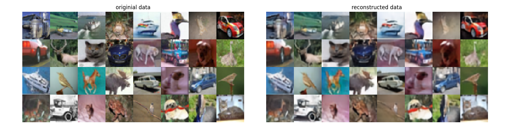

# Hierarchical VQ-VAE

[](http://www.repostatus.org/#concept)
[](https://github.com/dirmeier/hierarchical-vqvae/actions/workflows/ci.yaml)

> Implementation of a hierarchical VQ-VAE in Flax

## About

This repository implements a hierarchical three-level VQ-VAE which has been proposed in [Generating Diverse High-Fidelity Images with VQ-VAE](https://arxiv.org/abs/1906.00446) using JAX and Flax.

> [!WARNING]
> The implementation (or maybe the hierarchical VQ-VAE) seems fairly sensitive to initialization. With a random seed of 1 (i.e., `config.rng_key=1`) the training is stable and converges
> after ten epochs (at least on a Nvidia V100). With some other seeds the loss might diverge towards infinity. This behaviour is the same between a ResNetV1 block and a
> ConvNext block.

## Example usage

The `experiments` folder contains a use case on CIFAR10. To train a model, just execute:

```bash
cd experiments/cifar10
python main.py
  --config=config.py
  --workdir=<dir>
  (--usewand)
```

Below are reconstructed images from the VQ-VAE using a ConvNext residual block.

<div align="center">
  
</div>

## Installation

To install the latest GitHub <TAG>, just call the following on the command line:

```bash
pip install git+https://github.com/dirmeier/hierarchical-vqvae@<TAG>
```

## Author

Simon Dirmeier <a href="mailto:sfyrbnd @ pm me">sfyrbnd @ pm me</a>
